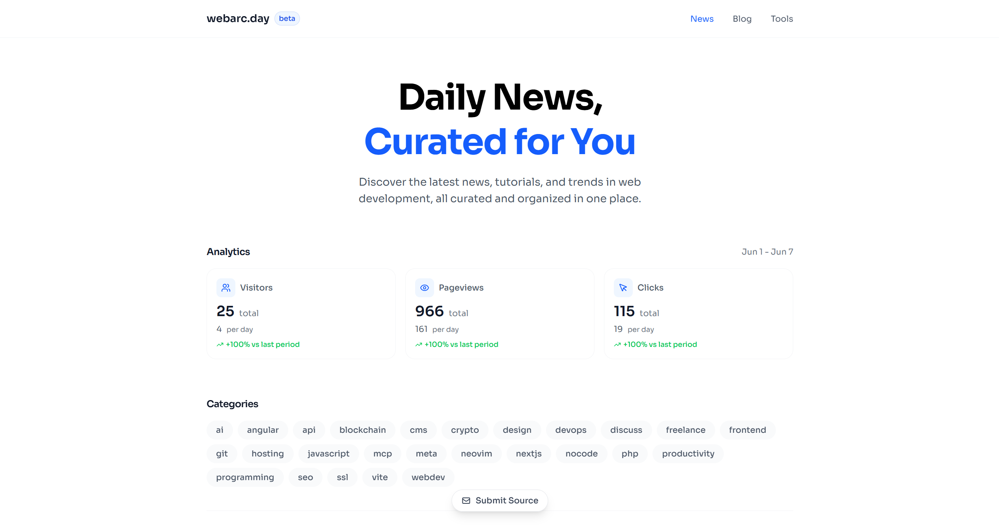

# webarc.day

A modern, beautiful, and open-source web application for aggregating and discovering the latest news, tutorials, and trends in web development. Powered by sources like Dev.to, Reddit, and more, webarc.day curates the best content for developers, designers, and tech enthusiasts—every day.

---

## 🚀 Features

- **Daily curated news** from top web dev sources (Dev.to, Reddit, etc.)
- **Responsive, modern UI** with date-grouped news cards and soft, accessible design
- **Infinite scroll** with robust, cursor-based pagination
- **Ad slots & newsletter CTA** with smart, non-intrusive placement
- **Favicon and category badges** for each news item
- **Loading, error, and empty states** for a smooth UX
- **Submit a Source**: Community-driven source suggestions
- **MongoDB backend** (official driver, no Mongoose)
- **TypeScript, Next.js App Router, Tailwind CSS**

---

## 🖼️ Screenshots

<!-- Add screenshots here -->



---

## 🛠️ Tech Stack

- **Frontend:** Next.js (App Router), React, TypeScript, Tailwind CSS
- **Backend:** Next.js API routes, MongoDB (official driver)
- **Email:** Resend (newsletter audience management)
- **Other:** Lucide Icons, Google Favicon API

---

## 📝 Contributing

We welcome contributions! Please read our [Contributing Guide](./CONTRIBUTING.md) and [Code of Conduct](./CODE_OF_CONDUCT.md) before submitting issues or pull requests.

- [Submit a Source](https://github.com/iamk3nnyt/webarc.day/issues/new)
- [Open an Issue](https://github.com/iamk3nnyt/webarc.day/issues)

---

## 🏁 Getting Started

1. **Clone the repo:**
   ```sh
   git clone https://github.com/iamk3nnyt/webarc.day.git
   cd webarc.day
   ```
2. **Install dependencies:**
   ```sh
   pnpm install
   ```
3. **Set up environment variables:**
   - Copy `.env.example` to `.env.local` and fill in the required values
4. **Run the dev server:**
   ```sh
   pnpm dev
   ```
5. **Open [http://localhost:3000](http://localhost:3000) in your browser.**

---

## 📄 License

This project is [MIT licensed](./LICENSE).
